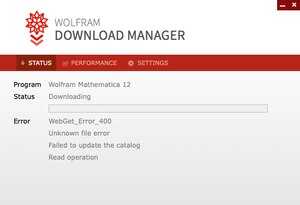

## 求带电体周围某处的场强
### 带电量为$+q_1$的点电荷.    
场强大小:    
$$E=\frac{q}{4 \pi \varepsilon_{0} r^{2}}$$
方向:由点电荷向外为正方向.
### 半径为$R$,带电量为$q$的均匀带电球壳    
场强大小:    
$$\mathrm{E}=\left\{\begin{array}{l}{0, \quad \mathrm{球内}} \\ {\frac{\mathrm{q}}{4 \pi \varepsilon_{0} \mathrm{r}^{2}}, \quad \mathrm{球外}}\end{array}\right.$$        

方向:由球心向外为正方向.    

### 半径为$R$,带电量为$q$的均匀带电球体    

场强大小:    
$$E=\left\{\begin{array}{l}{\frac{q}{4 \pi \varepsilon_{0} R^{3}} r}, \quad \mathrm{球内}\\ {\frac{q}{4 \pi \varepsilon_{0} r^{2}},\quad \mathrm{球外}}\end{array}\right.$$
方向:由球心向外为正方向.    

### 线电荷密度为$\lambda$的无限长均匀带电直线

场强大小:    
$$
\mathrm{E}=\frac{\lambda}{2 \pi \varepsilon_{0} \mathrm{r}}
$$
方向:    

Sunita 19:38

Hello. How may I help you?

Si Huan 19:39

hi

I got smoe errors when I use wolfram mathematica download manager to download Mathematica 12.

like this

Sunita 19:39

Do you have your Activation Key? I can check the status.

Si Huan 19:40

yes i have a try key

my english is poor

Sunita 19:40

Can you provide me with the Mathematica Activation Key?

Si Huan 19:40

Your trial activation key is 4409-0795-PG3K8L.

Sunita 19:41

One moment, pelase.

*Please

Si Huan 19:42

ok ok

Sunita 19:42

What is your operating system?

Si Huan 19:42

mac os version:10.15.2

Sunita 19:44

Have you tried using a different browser? Like Firefox.

It may be caused by a firewall on your side.

Yes

Si Huan 19:44

You mean use a different to download the Download Manager?

You mean use a different browser to download the Download Manager?

Sunita 19:45

Can you try using Firefox browser?

Sunita 19:51

Ok, I am checking if they are any other options.

Si Huan 19:51

Actually there is no firefox browser on my computer. I downloaded (Download Manager for Wolfram Mathematica 12) using chrome. And it didn't work.

I think it has nothing to do with what browser I use

Can I get an offline installation package.Just like “Mathematica_12_Chinese_Mac.dmg”

My English is not good. If my tone is weird or impolite, please forgive me

Sunita 19:55

I will need to refer you to the our U.S support team. to provide you with an alternative link

It is ok, I understand you completely.

https://wolfr.am/Jqi4KVAB try the following link, please.

Si Huan 19:56

Thank you!

Sunita 19:57

Let me know if this works for you.

Si Huan 19:58

I can open the link. And is it the Chinese version?

Sunita 19:58

Yes, it is.

Si Huan 19:59

Thank you. It works. I am downloading it

Sunita 19:59

Good News! Thanks.

It was nice talking to you. Have a great day, goodbye!

Si Huan 20:00

Good bye. Have a great day.

Read

Sunita 20:00

Bye.

Sunita has closed the chat.