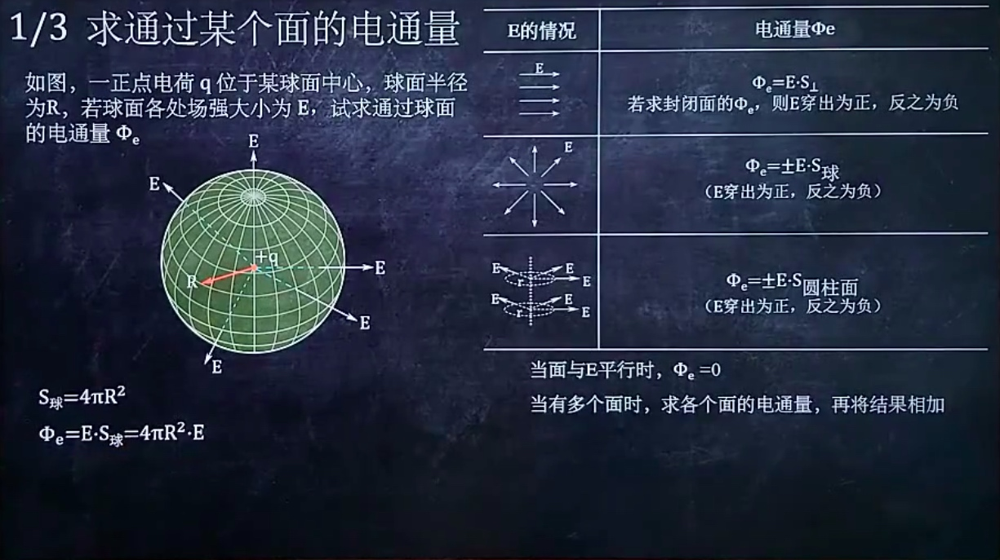
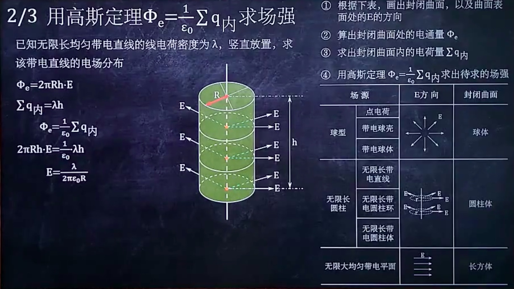
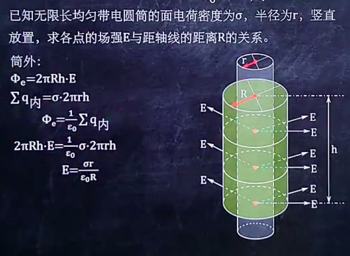
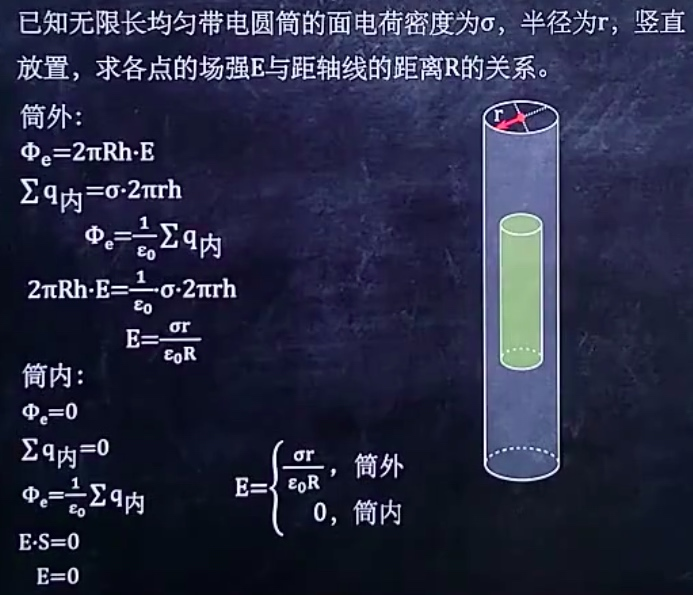
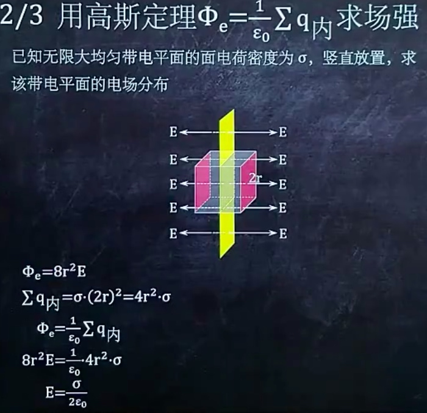

## 求通过某个面的电通量

### 点电荷，球面

### 带电直线，圆柱体

## 高斯定理 $\Phi_{\mathrm{e}}=\frac{1}{\varepsilon_{0}} \sum q_内$ 求场强

### 已知直线线电荷密度，求电场分布

### 已知带电圆筒面电荷密度，求各点场强

### 已知带电球体半径与带电量，求各点场强

### 带电平面的求法

## 电通量、高斯定理注意点
