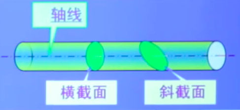

# 一、材料力学的任务

> 在满足强度、刚度、稳定性要求下，以最经济的代价为构件确定合理的形状和尺寸，选择适宜的材料，确定系统的许可载荷而提供必要的理论基础和计算方法。

- 材料力学是研究构件承载能力的一门学科。

- 工程结构或机械的各组成部分统称为构件。

  > 工程结构或机械的各组成部分统称为构件

##  承载能力

1. **强度**：构件抵抗***破坏***的能力.

   > 破坏：显著的**塑性变形**或**断裂**

2. **刚度**：构件抵抗***变形***的能力.

   > 弹性变形

3. **稳定性**：构件保持原有平衡状态的能力.

# 二、材料力学的研究对象

## 工程构件的基本类型

- 杆

  > 长度方向的尺寸比另外两个方向的尺寸要大得多,呈一维结构

- 板

  > 厚度方向的尺寸比另外两个方向的尺寸要小得多,呈二维结构
  
- 壳

  > 有一定曲率

- 体 (块体)

  > 三个方向的尺寸具有相同的量级

## 材料力学的主要研究对象: 杆

