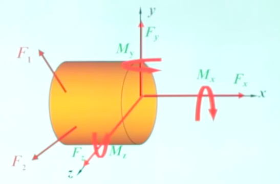
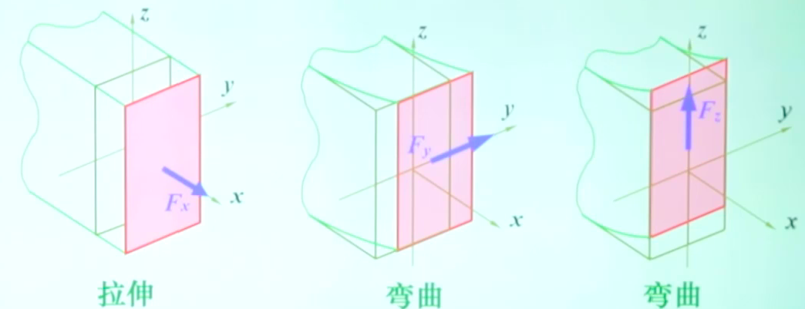

 

# 1.外力及其分类

## 定义

**研究对象受到的周围物体的作用力。**

> 外”是相对于“内”而言的，研究问题时要确定研究对象！

## 外力分类

graph LR
A((外力))-->B{按作用方式}
A-->C{按随时间变化}
B-->D(体积力)
B-->E(表面力)
E-->|受力面大| F[分布载荷]
E-->|受力集中,点接触| G[集中力]
C-->H(静载荷)
C-->I(动载荷)
I-->|周期变化| J[交变载荷]
I-->|短时间冲击| K[冲击载荷]

# 2.内力

## 定义

**指由外力作用所引起的、物体内相邻部分之间相互用力（附加内力）。**

## 内力的求法——截面法

- 第 1 步：截开。在所求内力的截面处，假想地用截面将杆件一分为二。

- 第 2 步：代替。任取一部分，其弃去部分对留下部分的作用，用作用在截面上相应的内力代替。

  

> 内力的两个特点
>
> - 内力在截面上是连续分布的，是一个分布力系
> - 当取出研究对象之后，内力就变成了外力，自然要满足力的平衡条件

- 第 3 步：平衡。对留下的部分建立平衡方程，根据其上的已知外力来计算杆在截开面上的未知内力*（此时截开面上的内力对所留部分而言是外力）*

> 静力等效：内力通过截面形心上的合力表示。
>
> 
>
> 将主矢主矩分解到三个方向上。
>
> **材料力学所指的内力是指分布内力系的合力**

