# 沙包向攻略

> LacryCat

这是一个沙包向16攻略，写的人本身也是沙包，无法提供触手级别的立回对策等问题。但是鉴于很多套路被人一遍遍的问很烦人，而太专业的数据流等物沙包们又看着费劲。所以写了这么一个东西。

当然，这不是一个合格的数据流或者一个总体概论式的东西，而只是一个沙包从感性上对于16的认知，和一些常用的，新人16可能不知道的套路的总结而已。也许丰富各位16的套路或者给新人16一个如何让自己升级的思想。但是你要从中考据如何应对各个机体（比如X动等），这是做不到的。因为咱也不是触手，打的机体也不多，能力所限，写不出。

欢迎触手16前来纠正错误和吐槽，也欢迎其他机体的机师前来说明对16的理解。

## 常用技能解读

> 与其说常用技能，不如说16各个体术的前景，或者说对16招式的开发和理解。

### 地面体术

AAAA就不说了，1-2断无择，3-4段都是上择，第三段前可以被任意弹幕取消，第四段只能用SC取消。

4A：4A和近A前2段一样，8F启动，特点是短以及略微对空。后续连段困难（有一个对空的：**4A  4A 623 JB J6A,4A 2B 7JB J6C**），但是由于发生速度还不错，在对战时，可以看到11区触手用4A点低空插动的用法。对地盲点少（无法A到16  2B，紫2B/3A时的姿势,爱丽丝DASH,YM近2A）。因为是能连打的4A，尽管只能连3下，但是收招硬直很小，是压制骗凹的手段之一，亦是贴身时拉开部分距离，使自己可以进行5A上择压制的重要手段。

远A:发生速度在远A里属于不错，12F，硬直大。16少有的上择手段之一。但是本身判定不是很远，对空略差，对地盲点少（**无法A到紫妈的2B  /3A**）。用来封空有一定价值，但是用来抢招并不是好的选择。

2A：在2A里属于偏慢的了，也是12F，但是硬直比远A要小很多。16重要下择手段。抢招/预读封地面DASH过来的体术是比5A更加好的选择（但是打不到核弹4A和青蛙蹲姿和19  6D）。另外由于16的蹲姿良好，经常可以利用对方JA对地判定较弱，而去打别人的JA（如内战，看见对方空降JA，你就可以2A点他JA，大几率把他康一套）（**文/YM/西瓜/UU/高达这5个机体请不要尝试**）。

6A：5A  2A近身AA后可用此体术取消，但是5A2A不康的情况下无法用6A进行连段。判定很微妙，近身时可以避开很多判定在压制中，虽然有下择的功效，但是由于后续较难，对方比较好猜（也好凹），请尽量少出此体术。5A/2A后最速6A是可以封各种起跳/插动（但是很难打到2DD）的，是个打乱动的价值高于择的体术。
注：

可避开：反击卡、16 黑白 红白 小爱 图书 YM2A 中国兔子 西瓜YM 小爱 UU 早苗 9  3A UU 核弹4A 小D  6A 天子远A。、9 中国紫 小爱 YM  DC 兔子西瓜YM 天子 DB 兔子DA
会被避开：紫和19的6D、青蛙蹲姿、核弹4A、天子远A （2A/3A/2B）、中国3A、兔子DC、红白2C、黑白214、UU623、16 623 
只会魔理沙补充：16的6A可以躲过黑白的升龙

上面所写避开均由判定打出，与发生速度无关，只是判定测试的结果（发生速度至少16不有利的情况下依然均可避开）多为近身才会出现…看似很多，其实其中真正作为立回起手或者压制中会放缝让你有机会6A的少而又少，在被避开的例子中也只有天子5A是16有利的，所以慎用。值得一提的是，在中距离情况下，对西瓜 兔子 DB 小爱DC依然适用，远距离对9  DC天子DB依然适用。还有近距离兔子DA 黑白2A 红白2A  162A 图书2A小爱2A  3A UU 4A都可以利用这点判定。而这些是比较常见的，或者说有可能会给你机会用6A微妙他的招式。可以多多注意一下。
不过依然危险，对方稍微控制距离，这个方法就会失效，所以请慎用。
Lapi修正：6A后6C/2B/2C（版边） 无缝 2C后各种SC无缝 （主要是2卡奇术3卡速符4卡伤魂）。2B/6C/2C以后压制还可以J2A打乱动或J2B或9D3D可以继续带入压制
9D1D3A抓小跳。对方灵少的时候6A后很容易DD，你这是623就一套连段。623虽然有风险， 但也有不用623抓DD的（虽然收获比623差一点）的方法：6A以后什么都不按，看到2DD就8D，6DD就继续AA。6A被6DD被反的几率很大，但你没用弹幕取消继续AA的话能用一套连段的几率也很大。
松永雪希修正：5A之后最速6A可以被16的623B插动，可以被19和紫6D躲掉。6A可以踩掉YM的6根
（即贴地无判定，反动较快的方式都可插飞6A）

3A：十六夜的神体术之一。**发动较慢（17F），但是判定强大，无法空防。在空战中进行1/2/3D  JA后落地3A是16拿取伤害的重要手段。**同时裸3A打无弹幕掩护，远距离来JA你的人也是非常棒的选择（极少体术可以康过3A，恩，你可以认为根本没有）。发动慢的特点使得他对那种后跳JA的打法依然显得有些无力，也需要预读才能不被弹幕打飞。对方在地面，**特意放帧在中距离内范围内3A可以打到6D  28等一切乱动，亦为部分16重要拿血手段之一。**而对付那些在中低空依然喜爱受身的选手，那么请狠狠的不出圈然后厨3A吧，打到他长记性为止……**但是贴身是打不到YM西瓜兔子16等人的蹲姿的（贴身也不需要3A了，所以我就这里不列举了，自己在贴身时尽量别用就好）**，这点需要注意。而**由于3A只可以被SKILL，或者说236和原623，22（几乎没人升级22，不讨论了，升级也确实没太大价值）取消**，使得在压制中3A的后续变得困难。尤其是当对方防错后，只打1HIT时不取消则会被确反，而取消方式中，原623又会因为太高而无法打到对方蹲资，使得236成为唯一安稳的取消方式…236更是因为3A错防时取消时间太短，而很难确认取消，从而被对方简单预读使得自己陷入被动…与之相反的，对方防对时反而因为丰富的取消链而使得对方不敢乱动（各种放帧623）…总之，压制中除非读到对方乱动，请慎用。
注：以下几人防错依然有2HIT，就是防错去2灵还可以随便拿623取消……所以**遇上这些人3A压制成了可以常规使用的方法**：中国 小爱 核弹 天子 图书。
另由于青蛙蹲资/站姿特殊，他站防时太过近身反而3A只能打1HIT，但是控制好距离依然站姿/蹲资都可打2HIT（另2A6A对他蹲资无用，所以多出3A吧）
松永雪希修正：紫的姿势也很特殊，距离近时3A可能无论什么姿态都只打到1HIT，距离合适时则都可以打2HIT……请自行去PRACTICE练习

DA：某些触手说这是16神技，但是由于我是沙包所以没太大体会。拥有一定的滑行距离，不错的发生速度（11F，也就是比5A还快），和不错的判定，可被SKILL取消且空防不可。是除去3A外又一不错封空选择（取消比3A要安稳一点）。但是没SC时，由于后续取消一般，所以也并不是太安稳。用SC时，如3卡速符，4卡伤魂，版边时还有2卡奇术，使得DA有着非同一般的灵压。其中DA伤魂，奇术都较难确认，请多多练习。3卡速符则由于对方防御了DA也可以进入压制，成了不需要确认的可以厨的使用方法…但是依然有很多体术在判定上无法拼过，如黑白DA等。所以……我也不知道能所以什么了，具体事项请入群问真相到底怎么用吧。恩，压制中是重要的上择手段，对方防错时请继续4A，无人可抢。对方防对时也难以确反，不过，总没5A安稳的，最大的好处还是在贴身距离也可以进行上择吧（毕竟如果不是上述碰到3A会悲剧的人，16是很少敢3A的，也就是只有2A  6A两个直接择的方式（还都是下择），否则就要AA(4A  4A)两下拉开距离才能上择。对方根本不需要猜，淡定一蹲就好）。
LAPI修正：DA压制后续可以有 236  623。236风险低 623收益高（此收益为连段JBJ6A  2000+出圈），不过还是推荐惯性远A。
雪希修正：DA后236遇到喜欢DASH过来的对手风险并不小，除非在苍天，因为苍天里16可以用623取消236.另DA后速符是有缝的，也就是对面可以直接8D走，所以这个恐怕也需要确认才能用了……另外DA打不到小爱贴身6D。
哈雷补充：DA（对手防）44（对手抢A打空）DA/DB  SC 似乎也是一种用法
真相补充：虽然不宜多用，但是DA是可以214取消的，DA214  J2A偶尔蒙一下人的成功率还是蛮高的
一水补充：DA  236最少不要DA完毕贴身后用,近距离还是623好.

DB：摸奖技。3HIT，滑行距离极长，12F启动。只能被SC取消，可空防。**对方防对难以确反，判定微妙。这个微妙的表示方式为可以凹对方JA，对低空体术有奇效**。而且DB之后不可受身时间极长（就没见过中了DB后可以受身的，无论是立回还是连段），尽管不出圈却可安心扔卡。可以在很远距离DB扎过去打乱动…也可以利用极长的持续和滑行距离来和别人拼体术（能打出判定来基本就拼得过）。不过对方不防依然是16不利……也就是当16没SC时，对方在地面只要被DB碰到只要安心A就好了，可以用伤魂和速符进行安心的连段，奇术则可能不稳。实际上，如果你喜欢用DB摸奖，那么还是多带3卡速符，这样DB之后扔出去这张卡至少可以进入压制，总不会进入不利的阶段。如果没卡，请谨慎使用……不确保能扎到在空中的对方时，尽量不要使用。
一水补充：和别人对拼DA的时候请改用DB.DB的打点比较低.距离...挺长的...

DC：擦弹技…但是启动不擦弹，使用后有一段会快速突进…擦弹是这个体术唯一的优点了，可空防只能被SC取消，各种确反（防错防对都确反），各种判定弱。有DC之后直接扔3卡伤符开凹的用法，也有对方防御后扔3卡速符的用法……不康很难连段（对方在特殊空中位置有DC  AAA 2B623B/J6A的连段）……总之不好用。即使是擦弹这个属性，我们也有原版623C这个更加安全适用潇洒的技能，所以即使你忘记了有这个技能也无所谓。

雪希补充：DB  DC后可以接3卡时符，DB目前没看到被反的案例，是不错的安稳用法。而DC是可能被反的，3卡会被点掉，所以需要控制好距离再使用此技能。
一旦进入3卡时间就是16表演时间，安心的往死里进行压制吧！
真相补充：DC的距离比目测远，而且加速较晚，作为极远距离摸奖技能比DB成功率更高…而且极远距离时很难确反，DC  4D神马的….

623B（地面发动）：神技！真正的神技，11F的发生，强判定，可被普通弹幕和623C取消，压制中打乱动非常强力，后续JB  J6A稳定出圈，连段中以其作为结尾的均为16高伤连法。具体用法将在压制篇中讲到。**立回中则可以打各种喜欢在你头顶绕圈子的人…而且身后有判定，对于那种喜欢绕背的选手来说具有非常棒的杀伤力**。但是注意无法打到全人类蹲姿。YM  6D姿势也打不到……另外623B虽然是压制中猜对方乱跑的重要方式，但是，只要对方不中就会被确反（近距离）。确反方式？阿拉~这是16攻略，而不是如何攻略16  = =||另外623B是可以欺负那些体术慢的人的，欺负的方式就是在AAAA或者DB之后直接623，有些机体想直接DA过来都会被打飞，恩，基本上是比16DA慢的体术都会被打飞（防对的情况下如此，因为最速的话这俩正好可以对康.所以推测11F以上的体术均可被打。防错则安稳的多，手速够快基本可以随便用…不过打空就被日飞哦~）

623C（地面发动）:**擦弹**。无法取消。和DC差不多待遇，不过一个打地面一个打空中而已=  =甚至由于取消方式根本没有这个问题，使得他比DC还无人问津。无法打到所有人的地面站姿。

### 空中体术

J6A：16空中的招牌体术，大概也是让  众多16最安心的体术。11F并不算慢启动伴随着是非常强力的判定，而又由于J6C的存在和其造成的相当长的不可受身时间，使得J6A起手时，可以有稳定  的出圈连段。而除去这个判定外，更加让我们舒服的是这个体术没任何乱七八糟的惯性，他会随着你的原本的DASH路线进行移动。也就是它可以**靠自然落地取消硬直来减少被防时的破绽**。这也使得众多16新手刚开始就从厨J6A学起。从刚开始的6D  J6A欺负对方判定不够，到高级点的空降J6A来利用落地取消硬直，到最后向老木棉和壳子等学习各种飘逸的斜切……然后……没然后了~虽然J6A足够强力，但依然有**打空硬直太大，持续较短**，  打到防御后后续取消困难等问题。尤其是在中空偏上，且不为落下的J6A时，打空自不必说。打到防御后，你弹幕对方可以D/DD过来反你，或者就直接猜空中  623。但是空中623是无法取消的，地面还能因为硬直等问题使自己不会被确反，但是在空中是很容易一套JA起手的连段的……猜对就1000左右收益，猜  错就被一套连段（至少可以有2000吧？）猜的方式只有弹幕和623……虽然因为623的存在使得16不会陷入绝对不利，但是相对来看，依然不利。所以  J6A好归好，用时谨慎。

JA:先写J6A再写JA的原因就是JA可以克服上述缺点（但是**在对付比你高的对手时，判定会有所不足**）。  后续J2A/J6A/J8A和各种弹幕取消的存在使得他在被防时更加安全。28  JA打空后其硬直较小，有足够的时间给你拉7/8/9D甚至是落地前再来一次JA的。不仅如此，JA的启动速度是10F（稍快，其实没多大感觉，除非内  战），4F持续（J6A才2F,这个感觉比较明显了），使得**JA是更适合在空中摸奖**。或者说是在不确定会打中对方时更好的选择。而除此之外，JA有着比J6A更好的对地判定，也就是你在别人头顶时，JA是比J6A更加强势的。JA是16空中摸奖的主力技，也是中近距离下，抓弹幕硬直的主力技能。**另外其实16  JA的判定依然不软，无需太过担心拼不过的现象。JA拼不过的J6A也不大会拼得过。所以安心用吧**……但是除非近版/版边，<u>**后续不稳是个大问题**</u>。28JA的高度受身的人已经无法用3A来抓了，所以**当确定能日飞对方时，且不确定JA连段后续可出圈时，还是请用J6A吧**。（近版由于JA起手的连段更高伤，所以……还是JA起手更好）
雪希修正：当JA打空时可以623C直接空降，不少人会撞上来或者原地扔弹幕，也可以弥补JA打空硬直的缺陷，使得对方即使在你JA打空后也不敢贸然进攻，而是乖乖退回去找更加有利的位置。

J8A:发动慢，判定看起来很像空中3A，其实也确实**从判定和发生上和3A很像**，  但是可空防了。值得注意的是J8A有一个奇怪的惯性，所以能打到的位置远远比你所在的位置要高。因为过硬的判定和极长的持续时间，是在你无法在高空出圈时  一个良好的抓受身的选择。另外又由于这个惯性，16有在较近距离下，别人28/2DD后自己也28然后2D  骗对方乱动，然后直接在2D过程中按J8A打对方的一个套路。因为看似2D下去判定打不到了，但是J8A的惯性和判定会强行把16又拉回到可打到对面的高  度，还有类似的打19时，通过3D绕过对方J2A的判定，然后J8A打对方判定空白区的打法。另外在对方防御时，这个技能比起J6A来，会变得更加的难以  变化。因为这时16往往是比对方低很多，623的判定将无法打到对方，也就是根本没有体术可以供我们取消了。**这(J8A)是压制结束的标志，后续也经常会变为对方有利的情况，所以请谨慎使用。**

雪希&真相补充：**请将J8A的惯性理解为横向惯性**，意思是说，如果66  J8A，则你会发现会被66JA  J6A或者其他人J8A滑行出更长的距离，从而打到看起来在水平方向很远的对手。
最常见的用法：当对方起身而自己离对方较远时，有人会直接8D起跳（在16开2卡杀人人偶压起身时尤其常见），那么16可以6D过去然后直接J8A来抓对方。
还有就是刚才上述所说的2D  J8A，这个其实是在对方拉8D想抓你时，16直接2D跑到对方JA不到的地方，再利用J8A的判定来打对方。
另外还有在空压时，直接3D则可能让对方以为你去抓落地，这时对方就会不老实了，想直接D到安全的区域，但是其实看似安全的区域，依然在16  J8A的判定可以打到的范围内。这个时候J8A就可以抓到对方的乱动了。这也就是16伪空压之一的3D  J8A。

J2A:16体术压制主力技能之一。发动慢（17F），持续短（2F），硬直大，判定一般。尽管从数据上看并不是一个足够强大的技能，但是因为使用时有奇妙的滞空，使得**起跳最速J2A可以打到所有人的蹲姿**。这样的特性使得在压制中，使用了地面弹幕之后，直接一个J2A可以打飞所有想DASH出去的人。但是注意这是有缝的用来打乱动的压制，如果总是厨这套压制，莫说对方可以凹你凹的很开心，像**核弹的4A，紫妈的3A    等都可以直接打飞你的J2A**。所以使用时还是要小心一点。至于后续取消的压制链，会在后文详细列出。立回中由于其各种缺点，J2A变成了一个不能常规使用的技能，但还是可以利用滞空这个特性，打出一些别人意想不到的立回从而获取收益。

**<u>J2A打逆专题</u>**：J2A  是16少数有较强身后判定从而进行打逆的技能，这项性能对于新人来说难以掌握，目前也只有少数16会用，但是思路非常不错，实际操作起来只要熟练还是能够  在压起身/推板时用到，从而出其不意的获取伤害，所以将这部分单提出来认真说明。同时感谢雪希的全程指导（此部分均为雪希测试）。另外对于文字指导我表示  无能为力，多练吧。总之不是起跳就是下落趋势的近地J2A，具体距离我给 不出

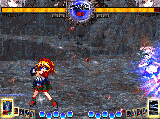

**补充：J2A因为其使用容易而又能滞空的特性，可以用来目押取消某些因为自己犯二而造成的不利状况。**
**例如说8D3D后位置过低，面向错误或者6D直接飞过头等等。甚至造成打逆。**

623B：不擦弹，发动比起C版并没优势，但是硬直略小。立回中由于这些特性使得B版的应用全面不如C版。但是在版边压制中，由于其硬直小的特点，可以进行一些难度较高的连段从而加大打乱动的收益。

623C：**擦弹**，16  空中擦弹的主力技能。拥有发动快判定硬，低空被防御后难以确反，不可受身时间长等优点。在密集的弹幕下，直接看准对方位置，一个623C将会直接打破对扔  弹幕的僵局，直接进入16压制的阶段。但是硬直大，且无论B还是C版在空中都没有办法取消（SC也不可），这使得当16在中空以上的623被防御住，或者  直接打空都会陷入非常不利的局面，往往会被确反（不排除某些人不了解623性能，判定还没结束就直接撞上来的…那是不能确反了…），所以依然要谨慎使用。  版边压制后623C也可以进入连段，但是难度比B版更高。另外在对付高速机时（尤其是YM），用623C立刻取消JB打飞对方直接上来JA的方式，是可以  制造让对方无法无脑JA的灵压的，而这个灵压是能保证16能够较为安稳设置弹幕的重要方法（如果不敢猜这个623C，低空中空16将难以设置弹幕，恩，如  果你体术还不够准，就只能直接飞上血条了=  =）。另外623C在花曇天是神技=w=

**补充：在对战某些喜欢空中徘徊的机体时，2B对空被擦的情况下，可以目押623B取消以打击空降。或者直接2B引诱，623B后手。**
**空降623C范围大，时间长，低空基本安全，DASH两次或者出招挥空后都可以尝试用623C取消。**
**一水：空中  DASH 623C擦单打人  个人觉得是必须掌握的**

 

 

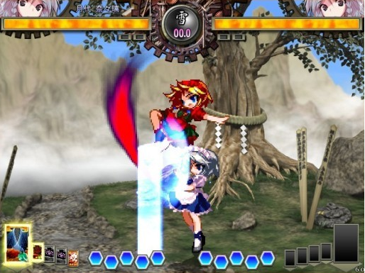

### 弹幕

 

终于写到弹幕了，因为弹幕将直接影响立回和压制，所以这里写的较为简略。尤其是压制方面，各弹幕的取  消和优缺点都将在压制篇中讲到。而立回……这个我写不出=  =只能说尽量写些简单实用的套路应用吧……另外16普遍对改卡认知不足，许多改卡的应用我没办法给出，但是在后续的SKILL篇会给大家提供一些其他16  的心得，这里就不列出了

 

5B：多HIT的C级弹幕。重要的立回弹幕，拥有较弱的追踪性，起手速度慢，但是相应的取消则显得快了许多，其轨迹较低，拥有不错的对地/低空/中空。

6B：和5B性能差不多，但是轨迹更高，对低空和地面性能弱了很多，但是对中空和高空则更加强大。**重要防空体术，除非极近距离，否则大多数情况下牵制能力要强于2B，是16对空神弹幕。如对付喜欢J2A的UU喜欢绕圈的19，喜欢长距离JA的文和天子，先手6B要比2B更好用。**

2B：16最可以依赖的弹幕。发动快，被打击判定好。**对于空中接近自己的对手，有着非常棒的干扰性，大部分直接JA过来的对手可以确认后再扔2B，往往能日回去**。  对高空更加强势，但是注意对地面则更加无力（比如YM  西瓜  兔子  16的蹲姿，2B经常一下都打不到，所以对方在地面时除非预读到起跳JA，否则不要使用）。另外在空降JA  踹到对方空中防御时，可以直接2B打那些想JA的人，如果不JA继续防，则可以直接3A。这样3A  2B的轮流使用，会让对方对你的空降无所适从，然后直接开始说：16太BUG了=  =。另外有一点指点注意，**2B虽然对空强，头顶上的刀子却十分稀少。对于那种直接从你头顶空降的人，2B是起不到作用的（最明显的就是UU  J2A，文JA）**，实际上这个位置16也没有其他体术/弹幕（改掉623也许可以）可以防御，所以看到这个体位时请果断防御或者逃走吧。2B的时候被人绕背或者擦过来JA了果断623B吧。

JB：发动慢，略追踪，**是16在空中少有的可以对付比自己高的敌人的弹幕**。拥有极好的掩护性。其中JB  66 J6A是16最基础的套路，也是初级16最爱厨的套路=  =（简单好用）

J2B：  与JB差不多，但是对地更加强势。如果说JB更大的作用在于掩护，那么J2B则是骗。因为16  体术对地的弱势，使得J2B成了在16在空中对地不得不用的手段。如在对付核弹3A，雷米2A，16  3A 天子3A，甚至部分人利用身材好而使用的2A时，16直接下去JA基本是找死行为，但是换上J2B，对方这样的动作反而会被你反日。如果对方老老实实的没  有动，那么J2B将成为非常好的掩护弹幕，16可以放心下去JA。可以说是**16空对地的主力弹幕。但是小心，如果你的位置不好，还经常使用这个技能，则可能被对方直接冲上来的28/29  JA给日下来=  =**

5C：会从地面上反弹后再打到对方，有一定的对地和对低空的能力……但是速度一般，立回真的不好用=  =我的认知中，只有推板和连段时才会用到。

JC:**7HIT  B级弹幕，可以弹墙反弹一次。16最可以信赖的弹幕之二**。  美中不足是无法对付比自己高的人。但是发生速度不慢，相杀极高，扔出来就基本能保证身位以下没对手弹幕（普通弹幕似乎只有对上核弹的C会很难清屏），后续  连段也更为简单易连。而且最好的奇妙在于反弹。尽管JC算是快速弹幕，但是如果能有效的利用反弹特性，会成为设置弹幕，对于空降的体术会有非常好的掩护作  用。另外有JC后勾引对方体术，自己拉防，利用反弹来赚伤害的套路…虽然不能多用，但是既然对方不吃这套，也证明他在JC掩护下不敢和你拼体术了。那么就  可以安心进入压制…另外,JC也是非常重要的推板弹幕。

6C/J6C：6HIT  B级弹幕。速度快的特点使其成为摸奖以及连段的重要技能。直线，是16对敌少有的远距离威胁。当你预读对方要扔弹幕时，这是个非常不错的选择。（如雷米原版214等）。J6C有略微的滞空。

2C：**压制中比较好用的弹幕,6A后2C无缝，2C后  奇术/速符/伤魂也是无缝**。削灵与6C一样，但是可能位置的关系，削灵到不了1.2个。在立回中是一个抓受身的不错的选择，另外由于发动速度和2B差距大，但是**<u>起手和2B很像</u>**。**对于那些想擦干净2B再出体术的人使用，会有意想不到的效果**。打矮子6C打不全，所以更推荐用2C削灵。

J2C：  也是由于身材的关系，使得在压制中削灵不稳。但是由于有一个向上向后的惯性，使得抓对方乱动变成了3D  JA而不是6D  JA。实际在压制中，这里DD掉弹幕，3D  JA依然可以抓到，而且不止可以抓2DD还可以抓6DD…对方不动的话，落地后16有利的时间也更长。但是注意，J2C粘人性能较差，所以再下去JA时，  可能会被抢A，对于核弹这种有着快速对空体术的机体，或者内战16这种快速对空的弹幕，J2C后JA并不如想象中那么好用（会被4A  2B直接日飞）。而在立回中，因为其强大的相杀，极快的速度，对付那种想在地面用弹幕抓你的人会变得非常好用。当你的空降J2B  JA都受到对方弹幕的限制时，J2C将是一个不错的选择。

214B：1级以后H214B将不可DD（214+左扇邪道）（H是蓄力的意思），延迟性非常好，对空也不错，远距离时214B后5B基本就会用弹幕封住对方所有空间，**有着非常棒的掩护性**，缺点是发动有些慢，延迟也有些大。在版边要是预读到对方异地起身，可以214B之后向后大跳然后JA/J6A/J2A打逆，不过起身距离太长的用不了

214C：扔出的方向与214B相反，压起身中更加常用。即使不升级，也可以保证在DA后依然是16有利的状态（214C  DA后还可以进入连段出圈），能够掌握好对方机体的起身时间的话， **214C是在没SC时压起身非常好的弹幕**。

236B/J236B:8  HIT C级弹幕比起6C来起手更慢，但是同样为高速弹幕。可以取消6C后使用.6C  236B/C的组合经常会让那些很热血的人吃掉1500的伤害。**比起C版来，8把刀子更加集中**。J236B有略微滞空
236C/J236C：同上。**比起B版来刀子扩散的更开。**
**补充：236的轨道比较微妙，8把刀子不是同时的。所以尽管有时看上去是擦干净了才出手的体术，但是还会被日飞……**

HJB  HJ2B H5B H6B：刀子更多了…没啥其他明显变化。
H6C  HJ6C HJ2C：也是刀子变多削灵变多了。压制中在H6C之后对手经常会乱动。是骗对方乱动的好方法。

### 必杀技

因为16的改卡普遍不及原技能好用，另外16的SC消耗低还非常好用，所以实际愿意浪费卡槽来带改卡16没几个……16们对于这些改卡也缺少足够的认知。所以单列出来来写好了…

> 楼下有钢琴男搬运的 ——by  钢琴男

### SC

> 原内容搬运到楼下…… ——by  钢琴男

### 其他卡组推荐（系统卡）

- 灵击：16因为缺少凹和插动的性能，所以其实被压时对方的压力会很小，再加上不快的起跳速度，极短的6DD距离，使得16逃压依然不够强。所以对付压制强的机体，灵击依然是必要的。
- 反击（羽衣）：太慢了…也经常会悲剧=  =不过作为抗压卡还是有一带的价值。
- 铜钱：没什么认知，希望更多16能开发，但是用来逃压确实不错。具体用法请去精华区查查树后没有人的帖子。有铜钱教学。
- 冻青蛙：据说这是控天神触才能用好的卡，吾沙包，不会用。据说用法：**往地上猛摔来控天，钻石星辰放对方脚底下，让对方摔上几千血，对上9字刺  太阳等强力控场卡，往地上猛摔来利用倒地时间躲过SC时间**。
- 回血（治愈星）：如果16用怀表，那么回血还是有一用的价值（3卡时间中回）比起上个版本要弱太多了，意义不大，但是可以一带。
- 蓝瓶：看似是不需要的东西，**但是对付早苗9字刺，和核弹的太阳有奇效**，对付在天子霸体时吃一张也不错（反正就是对付控场卡的）。算是对策卡，当燃料烧也不心疼，对付上述SC时，带几张是不错的选择。

## 连段

> 16连段有定式的，打的多了自然就知道该怎么打怎么出圈。16连段不追求高伤，追求的是稳定出圈。但凡一个16可以做到碰到就出圈，那么实际上他的  连段就没有再增强的必要。16连段伤害再高也不过比民工多个400血，所以刻意追求16的连段是没什么意义的。而一旦连段出圈的话，各种压起身卡将用的非  常顺手，后续的收益将远远高于高伤但是不出圈的连段。（不出圈的话，你会不知道能不能把杀人人偶和时符扔出去，这样会使得压起身卡都变得卡手……而16的  输出主要还是靠在压起身SC后的后续压制）
> 这里介绍的连段多为民工出圈连，在民工出圈的基础上尽量追求高伤。这里将列举出的连段较少，将以实用为  主，会把各种起手，各种位置的连段尽量都介绍一下，很多甚至在练习模式都难以练习。不过请先记住，到实战中没准哪次灵光一现就打出来了，以后就会越来越顺  手，那么你的16连段能力就会越来越强。当然，比起看我的这些讲解，更加重要的是实战中的练习，更加容易直观的方式是看触手的REP。

>PS1：“/”代表可以换的方式，（）里则是可以多加上去以提高伤害的方式。CH是康的意思
>PS2：在结尾处，为了那些喜欢打连段的人，本文也会给出一些有意义的罗曼连。
>PS3：矮子包括：雷米 西瓜  妖梦 兔子

### 连段1：AAA  2B J2B/B （JA） AAAA 

**版边全人类站姿成立，版中除去YM外站姿都成立（但是对于矮子双方距离要求有点苛刻，需要贴身），至于蹲姿，版中实战中基本没人成立，版边比较高的成立的比较多，具体情况自己打吧**……是16最重要的连段。另外要是高度过高，最后的JA  AAAA连不上的话需要改成JA  J2A。它重要并不在于它高伤，也不是在于实战中好打（其实版边近A起手真的很难做到），而是在于这也是16压制重要的基础的套路。版边全人类站姿必须熟练，版中可以不做要求。
当然这套连段还有更高伤的变种，也是比较简单，但是高伤的多了，也对身材有些要求，究竟那些人物成立请自己去打吧，正好练练连段，注意以下变种都是版边连段。
变种1：AAA  2B JA J2B （JA） AAAA
变种2：AAA  2B C JA J2B （JA） AAAA（矮子+紫不可用）
变种3：AAA  2B JA J2B JA AAA 2B C JA J2A(早苗  16成立，好像还有一些人成立..)
变种4：AAA  2B JA J2B JA AAA 2B JA J2B JA AAAA（16限定）
变种5：AAA  2B C JA JB JA JB JA AAA 2B C JA J2A （19限定）
**这里JB/J2B之后的JA可以用3D或者6D取消，均可，哪个顺手用哪个，6D需要目押JA时机，3D需要最速JA**，各有各的好，如果是3D取消，那么踹不中就踹不中吧。另外注意J2B和JB是不同的，J2B在版边更加稳定，JB在版中更加稳定。**<u>不过在版边对付比较矮的人的时候，JB可能是无法出圈甚至是继续连段的。</u>**
最后还要说下AAA  2B C JA这里，除去身高原因外，**打核弹和小町时这里如果JA的太快会连不上J2B，必须放帧目押才能成立**……所以究竟对上核弹用这套连段好不好，请各位根据自己的连段能力确定吧。

### 连段2:  AAA 2B C 236B/J6C

全版全人类连段（**除去YM  兔子 16  西瓜蹲姿**）。  是重要的16民工连，在版中近A起手只有这套连段是最稳妥的，但是由于身材和位置等关系，可能无法出圈（重点在于2B的打击数，身材好的则可以出圈）。但  是考虑到地面打不出圈对面受身也是低空，16用3A抓起来很容易，所以这里只要不是远版，不出圈也无伤大雅，对方不敢受身，那么就可以直接扔压起身的卡  了。远版的话，这套出不了就没办法了。

### 连段3：AAA  2B JC JA J2A JB 

变种1：AAA  2B JC JA AAA 2B (C) JA J2A 
变种2：AAA  2B JC JA JC JA J2A
变种3：AAA  2B JC JA JC JA AAAA
这套连段的排名伤害是由低到高，难度也是由低到高。这是一套近版连段，也是16推板的重要套路之一。至于限定是与连段2相同，但是这套比连段2更高伤，也能更稳定的出圈。**最大的好处在于连段结束后双方都在版边，对于后续压起身显得更好。**

### 连段4：AAAA  JA J6A JB/J2C/623/J236

  变种1：AAAA  J2A DA 623(近版，J2A要最速)
16重要的版边/近版连段。623结尾伤害正好是2500，JB  J2C可能略低，但是**623结尾很可能将无法出圈。版边时对于红魔不成立**。最明显有点就是耗灵少，但是追求稳定出圈的话，其实伤害不如连段1和3。但是这套连段有个最大的好处，**就是连段2,3中无法出圈的人物都可以用这套出圈（即YM 16  兔子  西瓜蹲姿）**。所以也是必会项目。AAAA后最速按9跃起用JA踢，还是很简单的。当然对于YM  16 兔子  西瓜蹲资还有其他出圈连段方式，但是那些连段要不有些难，要不伤害不如这套（显然耗灵也比这套多……），所以其他的就不列举了，乖乖练这套吧。

### 连段5：6A  5B/2B J6A/623B.版中  6A连

2B和5B不是关键，哪个顺手用那个。重点是623B结尾的话会高伤，J6A则更好控制出圈。具体用哪个根据自己顺手程度来看吧。
变种1：6A  623B JB （J6A）（更高伤）
变种2:6A  6C/2C JA J6A(JB) （近版，版边才可使用的连段，6A康后连段不成立…但是考虑压制中2C  6C都是无缝，所以6A打到乱动，连这套的机会很大）

### 连段6:5A/2A  2B （  ）

版中5A  2A连（）内是任意补充，16  2B后无非就是C  J2B之类的东西，请参考连段123的各种使用条件及连段方式，没啥好说的……

### 连段7：5A/2A  3A DB （对地面）

2A 5A后接3A是很稳的，但是后续会根据位置不同而变得很难出圈（版中），**这里用DB不会出圈，但是不可受身**，可以安心后续压起身。至于其他后续则要看3A能打几下。两下的话可以DC，一下的话只可以DA  623B和DB了…**除去DB外，DA  DC的后续都可受身，要记得用3A继续抓受身**。另外**3A只有1HIT的话是没有LIMIT的**，  也就是DB/DA之后依然可以接各种SC而不用担心伤害过低而不值得扔（如速符，伤魂，奇术），所以其实也不错。至于对手被打到版边，如果3A只打  1HIT则可以DA  623B JB J6A出圈，如果打两HIT，那么可以进入JA  J6A JB或者JA  J2A 623B的连段，稳定出圈。

### 连段8:5A/2ACH  6A 5B/2B 623B/J6A

没啥好说的，和连段5很像，不过注意这里**5B会变得不稳，所以推荐2B。**

### 连段9：(JA)  J2A (JA) J2A (DA/5A) 623B/2B/J2B

16 重要的连段。623B的优势在于高伤，2B，J2B的优势在于给16更多的时间扔压起身卡，或者蓄214C。因为压制中经常会遇到被J2A打到乱动的人，  所以这套连段拿到的伤害十分可观。如果JA  J2A JA J2A的话，可能有些人会发现DA后623B连不上，那么这里的连段的窍门就在于**第二个JA稍微放帧**，等16跳起后有落下的趋势了再踹JA，那么DA  623B就稳定了。**不过实际上不打DA也就差80的伤害，不踹DA的话JA就完全不需要放帧，为求稳定不连个DA什么的，最喜欢了。**如果踹了DA  623B不能出圈……那么就要DA踹慢点，让对方身位更低，这样就出圈了。不过当然，也可以通过直接623B来回避掉。另**外623/J236结尾的连段有落地慢，回灵慢的缺点，不利于丢214或者人偶压起身，所以对付uuz这类起身速度快的机体，建议2B出圈**
变种1：JA  J2A JA J2A JA J6A
优点在于0耗灵。伤害比直接623B还高，成功条件如上，连不了的话，第二个JA请放帧。
变种2：JA  J2A J2A J2A(纯粹为了帅，潇洒)

### 连段10：3A  JA J6A J6C

3A起手的全版连段，**JA需要大跳29（建议按法是268）才比较稳定**。也是稳定出圈，但是位置有些要求。有两种情况可以比较稳定吧，第一是贴身3A到（注意上面提到的，很多人蹲姿都不成立，所以……不建议）第二种是打到空中的对手（恩，这个最好了）。
变  种：3A  JA J2A (DA) 623B （版边限定，伤害略高，只要3A打中2HIT就可以稳定出圈，版边推荐，当然J2A也可以换成JA  J6A JB，伤害差不多，但是更加简单……如果3A只打中1HIT，那么变作3A  JA J2A J2A DA 623B，第二个J2A需要最速，要是连不上就JA  J6A J6C吧）

### 连段11：DA  623B JB 66 J6A （JB）

DA后连段，**只对站姿成立**，注意JB后只能用66最速J6A，6D是不成立的。全版成立。
变种1:DA  623B JC J6A JB/236B
对方在版边时才成立，JC要放帧，J6A要最速。伤害比起上面的要多个200左右
变种2:DA  623B J6C JA J6A J6C 623C/44 J6A
高伤，2400+，但是**这里623B要至少LV1以上才成立**。J6A结尾的话也必须有44才能连上。比起上面的连段，**这里J6C要放更多帧才能成立**。要放到什么地步呢？举例来说，这套连段甚至可以J6C在最低距离使用，落地取消后再跳起来JA继续连段，而且非常稳……所以基本**这个J6C是扔的越低连段越稳**。哦，如果没前面那个DA的话，623B  LV0这个连段也成立。

### 连段12:4A（4A）  623B JB J6A

4A起手打到浮空才能进行的连段，是众多4A连段里最稳定的一个，稍难（主要是反应不过来连段），实在**实战打不出就别打了，准备JA/3A/2B抓受身吧**。变种参见连段11。

### 连段13：JA  J6C (JA) J6A JB/236B

16 最重要的民工空连之一。近版版边均成立。JB稳定出圈，236高伤。说这套连段重要的原因在于JA  J6C是16基本的空压套路。J6C后66  J6A非常稳定，近版的时候可以换成9D（注意9D  JA才是空压重点，所以近版时可以多练练9D  JA），这样JA踢到后更容易保障出圈。

### 连段14：（JA)J6A  J6C （J6C）236B

版  中版边都成立的民工空连。伤害不错，括号内的J6C是保障出圈的。如果没那么手速，不连也可以。但是由于位置关系可能会出圈不稳，那么可以236B后66  J8A抓受身。请注意这套连段的起手时，需要JA或者J6A是平行飞过去或者上升的（也就是6D  9D 8D 7D JA/J6A），**下降趋势的J6A，会使得这套连段非常不稳。**

### 连段15:(JA)J6A  JB J6C

近版版边连段。**优点是稳定出圈，不用第二次DASH。当空中DASH2次后，可以用JB  J6C结尾来稳定出圈，记得就好。**

### 连段16：(JA)  J6A JB/J6C (JA) J6A(JB）

近版版边连段，需要一次DASH，优点是耗灵少，出圈稳定，<u>伤害低</u>……

### 连段17：J6A  JA J6A JB

J6A是下降趋势时，离版边较远时地面也较高时用的连段，这个JA是再起跳时踹到的。

### 连段18：J6A  (JA) J2A (DA) 623B/2B/JB

依然是下降趋势的J6A的连段，**但是和上面的比连段位置要求不一样（在J6A后对方较低时使用）**。DA的问题就不说了，不过这里JA没放帧的问题了。而那个JA连不连则在于对面的位置。**对面比较低时，那么不连JA的话是连不上J2A的，必须打（这个位置把J2A换J6A也会导致连段不成立）**。当J6A成立时直接J2A也成立了…注意的是由于J2A太慢，所以如果JA后J2A的判定无法覆盖到版边的话，J2A会踹不到对方从而导致连段不顺利。不过只要623B结尾，伤害比起J6A来总是要高点。

### 连段19：J6A  (DA/2A) 623B JB (J6C)

下降趋势J6A的连段，当**对面低到连段18都不成立时（比如对方在版边角落）可以试用此连段**。去掉2A/DA，将会再次降低对位置的需求。**实在连不上就不连了，反正无法受身，直接扔卡吧。**

补充1：J6A  5A 3A(1HIT) 236
补充2：J6A  5A 3A 214B/623C

### 连段20:JA  DA 623B JB J6A (JB)

低空JA到对方时使用的版边连段。但是其实也可以再起跳JA后进行连段，那样的话就参考如上空连吧，记得如果用J2A  623B的话，那么第二次J2A前是不可以JA的。

### 连段21：CHJ6A  J8A JB （J6A）

J6A康后民工连段，J8A是再次起跳后打出去的。当对手过高时只有这套是稳定的。非常简单的连段。

### 连段22:CH  J6A (JA) J2A (DA) 623B

J6A康后高伤连段，要求对方要低一点。没啥好说的。

### 连段23：J8A  JB (JA) J6A JB

J8A后连段，JA  J6A是拉8D  9D上去打的，具体位置自己练习吧-  -。J8A康后也可以接JA  J2A的连段，那是位置要求高些。 

### 连段24：J2A  JB J6A/JC

版中推板时打到乱动的稳定全版连段。另外还可以打J2A  J6C 236B……反正随意啦。
近版时可以DASH过去进入JA  J2A DA 623B，还是那套民工，不难。

### 连段25：JA  J6C J6C 236B

远版时JA起手连段。**尤其当JA康了时，J6A是连不上的，只能用这套……但是真的很难出圈=  =可以直接J6C  236B一下准备抓受身了。**
**补充：出圈主要取决于第一个J6C打中多少。如果5HIT都打中基本就出圈了，只打中3下，就准备抓受身吧。4下？看位置运气手速……**

### 连段26：JA  J(2)B JA J(2)B JA AAAA/J2A

关键是高度，要是最后一个JA踢的太高了就只能J2A结尾，另外就是要是J2B打中蹲姿，JA很难踹上，可以简化为J2B  J2B JA J2A。
变种1：JA  J2B JA J2A J236（帅一点，而且更高伤）
变种2：JA  JC JA JC JA AAAA/J2A (J6C) (版边或者近版限定，这里的JA  AAAA会相对难接)

### 蛋疼连段：（不给详细解说了，闵娜桑自己蛋疼吧……）

AAAA 6A 623B（近版贴版都可）
AAA 623B J6C JA J6A J6C 623B （623BLV1以上，近版+贴版）
JA JB JA JA JB JA JA JBJA（蓝屏啊，三滴水啊，可以一直LOOP下去） AAA  2B C JA J2A（身高限定）
苍天限定：AAAA  236 623
梅雨限定：623B（下落的）  623B 623B 623B 623B
AAAA AAA 2B 623B（全人类近版贴版成立）
AAA 2B C JC JA AAAA（近版，对位置要求严格）

## 压制

> 16最重要的部分。尽管这里压制会给出很多套路，但是这个游戏是没有完美的压制的。要想别人逃不走，就要猜对方要怎么逃。要想让对方不知道怎么逃，  就要变化自己的套路。虽然会给出一个压制表，但是希望更加注意的是下面无法给出表格的压制套路评价，和一些如何应变的方法。毕竟套路再多也有穷尽的一天，  对方看透了，就压不住了。原本这里想做个和青蛙攻略一样的图出来，但是一是我能力有限（其实就是懒=w=），二是确实变化太多，了解压制的变化思想是比记  套路更加重要的。
> 基础压制套路：AAA  2B J2B JA AAA 2B J2B……
> 这是16最基本的循环，也是上文中我提到的那个非常重要的连段方式。基于这套套路，我来试试把压制的变化拆解开来给大家看。

**压制的思想：16的弹幕削灵能力很强，没有体术择对方也铁不住，所以不必刻意追求体术在压制中削灵的作用，而应将把体术的重点放在打乱动上**。压制的收益有两点，1是拿血，2是攒卡槽。注意到压制第二点的收益是有极限的，也就是当16的5卡都攒出来了，那么压制的总体收益就变少。而注意到16是有大量的强力的压起身的卡的，那么16压制在令对方再次倒地后，压制不但没结束，而且下波压起身的压制将更加强势，所以**别总想着一次压死，或者学其他机体故意断连段，因为16的压制逃点还是很多，如果你这次一断，对方逃了，手里卡没扔出去，那就得不偿失了**。  而获取伤害的方式也是有两种，1种就是把对方5灵全磨爆了。这种基本很难做到，对方不会乖乖给你爆，而是想办法逃。所以基本第二种是更加常见的方式，就是  抓对方逃压，或者说是打乱动。而在这逃与打乱动之间，就是真正的16需要进修的地方。哪些点的哪些逃法可以怎么抓？我下面将尽量详细的写出来。

基础压制套路：AAA  2B J2B JA AAA 2B J2B……
这是16最基本的循环，也是上文中我提到的那个非常重要的连段方式。基于这套套路，我来试试把压制的变化拆解开来给大家看。

这套压制逃压点：

1、第三段A之后，这里是无缝弹幕，那么可以直接6DD或者2DD或1DD
2、2B之后可以直接8D可以直接6D可以后小跳，可以2DD可以6DD

那么16可以：

对付逃**第一个点**的逃法，那么可以直接出  AAAA，A出第四段来，进入连段。但是注意如果A出第四段来，且手里没有三卡速符，那么压制就结束了。

**第二个点**：分逃压方法

1. 直接8D  6D的。可以将J2B换为J2A
2. 对付6DD  2DD 1DD的，只能623B或者JA，J2A打不到。

这样我们就发现，如果对方可能最速DD掉2B，16将陷入一个非常尴尬的地位。要不让对方逃了，要不猜623B/JA。如果猜错，那么就是被确反。所以我们认为这套压制缺陷很大。

那么我们可以做出如下更该：那就是将2B  换成5B。5B因为起手速度慢的特点，任何DD，DASH乱动，都会被J2A打到。所以我们猜想可能会更好，而且J2A可以打乱动，除了凹没必要担心什么，所以可能可以尽情厨。那么压制套路变为如下形式：
AAA 5B J2A ？
J2A之后如何？当然有几种选择：1.J2B  66 JA AAA 2.J2C 3D JA AAA
首先考虑第一种66  JA的。
那么压制套路如下：AAA  5B J2A J2B JA AAA ……
那么逃点如下：

1. 第三段A后直接DASH或者DD走
2. J2A后直接8D  6D 或者  2DD 6DD 1DD。

对策如下：

1. 变为2种方式，一种是最简单的继续A出第四段（PS:AAAA系列中任意逃压位置都可以用继续A下去的方式打一切非凹逃压方法，以后就不表述了，默认有，不写）或者5B后直接623B。 
2. 直接623或者28  JA堵8D和2DD  直接落地A堵6DD和6D。至于小跳，这里先不管，因为16打小跳真的很难受，这种逃法需要更好的空压功底，在后文会写出。

**第一个逃点**没什么可说的，623B可能更好做到确认反逃压（反正我确认不了），但是如果确认不了，那么猜错了还是被确反，被人日一套，风险大。AAAA不会有被确反风险。
**第二个逃压点**。比较2种方式（分别为直接623和普通体术），那么623的优点是不用猜6D和8D。而直接体术呢？则首先是收益更高，其次是有反悔的余地。  也就是如果猜错了，那么鉴于16的JA和落地硬直不是很大，还是可以改变DASH路线进行追击。但是相比于623，就不一定能稳定拿到伤害。

这样看起来似乎16的压制就可以了，所有逃压方式都有很稳妥的办法进行封锁，只要猜就可以了。但是作为一个压制强机的使用者，真的满足了么？首先，在5B这  里其实会被人直接2A插飞，J2A这里会直接被凹飞。其次，我们是不是有其他办法减少被猜对的几率呢？答案是有的。第一是多变，第二是灵压……

先从灵压说起。压制中的灵压并不是靠等级差距来建立的，而是靠压制后续。比如5B  J2A这套用多了，别人在你5B之后就不敢动了，那么我们就可以改回J2B的压制方法。一旦改回J2B，我们发现可以通过最速66  JA封住一切压制，而后续可以放帧J2A，然后落地5A，这样就可以压制封住一切逃压而无需去猜（除了凹，骗凹会在下文讲到）。少去了直接J2A后需要再  猜一次的风险。同样，在AAA  5B这里也是如此。AAAA出多了，就算知道5B这里可以逃可以2A点16,也不敢贸然出手。甚至我们在前面讲的5B  J2A这里，灵压足够大都可以不起跳直接地面体术再择一次再扔弹幕，J2B  JA这里可以直接不JA，继续66  J2B 再66JA落地。这样的好处就是加速了对方破灵，减少压制时间，对方敢猜的地方和时间越来越少，对于我们压制者无疑是有利的。

但是显然总是5B  J2B是行不通的，人家一旦发现你总是这个套路，立刻就逃了，一旦发现你总是这样2择，那么胡乱的猜总比直接生生看着自己被压爆要好。灵压也就不复存在了。

那  该如何保持？方法就是多变。比如AAA  5B这里，如果只点AA就后续5B会如何呢？对方会反应不过来，不敢逃。如果AA  6A 5B呢？有时你会发现对方会防错一灵再被5B粘到。（但是6A如果对方防对，就要准备猜地面623，风险大，所以不是那么好用）16会更舒服。
甚  至AA都不用，变成4A  2A 5B，这样对方还要防住16的体术择，防错就跑不掉。多变可以防止过早的暴露较为稳定的对方熟悉的逃压点（16只要不出623，就没有稳定逃压点），而使  得压制者始终保持在较为优势的地位，但是请注意，无论什么逃压点，一定是下个后手的是弹幕，所以其实较为稳定的逃压点是不变的，无论怎么变，要记得观察对  方逃压的习惯，多打乱动，制造灵压，才能进行有效的压制。而在压制中要尽量快速削灵，因为这可以让对方“慌”起来，更容易乱动，对方在2灵以下时几乎就必  须考虑如何逃压的问题而不可以继续观察，这时的打乱动（J2A  JA 623等）技能会格外好用。

然后现在再说插动和凹的问题。

什么是插动？就是对方在被压制时，直接用体术或者弹幕点。比如16的5B就是一个插动的点，很多人可以直接2A日飞5B。那么怎么对付插动？第一种方法已经  讲了，就是多变，从AAA  5B变为AA  5B对方就不敢动了。第二种方法则是放帧。比如AAA之后少有16是愿意进入第四段A的，而2B  6C什么的对于体型较好的对手，都是无缝压制，如果16都是最速使用的，对方完全可以无脑的狂点2A，只要有缝那就一定是5B，那就可以直接插到。那么  16就可以换种方法，故意放慢2B，这样对方会松防，但是不会比16的2B更快，16的2B就会把对方2A点回去，从而直接获取伤害，然后进入连段。这就  是放帧的意义。同理，不但弹幕可以如此放帧，体术也可以。比如AAAA就故意放的很慢，让对方觉得可以动，结果一动了就被体术打飞。但是注意JA  J2A是天然的就有很大的缝的，对于出手快对空强的机体，可能会被日飞……当然最经典的就是16的3A放帧。压到一半不压了，后退一步，然后一个3A……  因为3A过硬的极大的判定，基本只要动，就会被16日飞。

然后是骗凹。这其实没什么好说的，对方凹的话这边就要骗凹，骗到了一套连段，骗  不到压制也不能缩（要不就没了压制，16没了压制打散打太痛苦）。要骗凹，首先要了解对方的凹性能，比如对方凹的方法是弹幕无敌还是体术无敌，还是两者都  有，是弹幕攻击体术攻击还是两者都有。弹幕无敌的就注意多用体术（很少吧…），体术无敌的就注意多用弹幕（如很多人的623喜欢凹16的J2A，那么换成  J2B即可）。两者都有的，就要注意改变下自己的套路了。比如对上天子的3卡菊花剑（弹幕+物理无敌，物理判定），5B后无论J2A  J2B都会被菊花剑凹飞，那么16就可以改变套路，变成5B  9J 2D。那么就骗凹成功了。或者干脆就不动，拉防就直接成功了（骗凹方法主要是拉防……和后撤）。拉防的话，看对方不凹可以考虑3A打乱动，或者直接5A过  去继续压制。至于后撤就是5B向后跳，那么一样，如果凹了就进入连段，如果没凹，可以观察对方动向，然后选择9D还是2D去抓两个方向的逃压，或者直接  3D下去JA（对方不动的情况，对于JA的目押要求可能有点高……）。当然还有可能直接凹5B，那么在地面上就可以靠放帧4A的方法来骗凹（4A硬直小，  比较好控制），比如4A  4A对方可能就以为16要出第三段A或者弹幕了（都可凹……）那么这个时候拉防，就骗到了。至于只有弹幕打击的，多DASH一下就好了，倒是比较简单…

**<u>基本压制思想就是如上，下面进入直接结论期间，就是体术、弹幕在压制中的优劣点说明。</u>**

### 体术

4A没择，基本只是放帧骗凹骗乱动用。

5A：重要上择，5A可以被3A  6A取消。因为6A可以被普通弹幕取消，所以总体来说比起A的第三段来更加安稳。压制中可以用4A  4A 5A的套路让对方错以为是放帧的AAAA。

2A：重要下择。注意打不到核弹4A，青蛙蹲姿，19和紫的6D。

6A：重要打乱动的技能。因为不快的发生使得其没有放帧的必要，放帧容易让自己变得很危险。6A打不到的见上面微妙总结。

3A：重要的打乱动技能。防错确反，不能确反的（也就是防错也可以2HIT的）见上面3A解说。重要的空压拿血技能。

JA：  打乱动技能，因为JA慢，起跳JA打不到很多人蹲姿和少数人站姿（矮子），所以想常规使用是不可能的了，但是对于那些喜欢最速DD掉16  2B 6C 2C J2B的人来说，只有JA是比较安稳的抓动方式。（当然有身材很不好最速起跳JA都可以踹到蹲姿的倒霉家伙，那就厨吧）（F式JA其实能踹到很多蹲  姿..）

J2A：极重要的打乱动技能。5B后J2A可以打一切乱动，空中JA后重要2择（体术J2A  或直接弹幕）。其他弹幕也可以打那些DD的不快或者想直接D走的人。

J8A：抓空中乱动的方式，如前面所说有3D  J8A打乱动的用法。另外66  J8A抓2DD掉弹幕的人也是非常重要的使用方式。

J6A：在空中可以取消JA……也是打乱动的方式之一。在推板中在双方位置太过分开时，会有比J2A更好的效果。尤其是落地更快，会更加安稳。（如果能安稳的打出J6A的话，有时太低是按不出的……）

623:16最重要打乱动技能。尽管风险大，但是记住一切乱动都可以被它打下来，当其他体术不行时，直接623吧……也是这个体术的存在，能让16的普通压制如此之强（后续压起身那是SC的功劳……）。

### 弹幕

2B：重要压制技能，速度的快的特点使其接大部分体术都是无缝的。但是**注意2B的后续体术会产生大缝，比如J2A会被核弹4A插飞了，2D会被菊花剑凹飞了……另外削灵不稳，对于身材超矮的人的蹲姿，可能一下都打不到。但是也是由于这点，可以用2B骗他们乱动然后直接J2A打飞**（打不到就无法DD了……只要对方没反应快到直接一看见2B就插动或者飞走，稍微楞一下就被J2A打飞了）

5B:起手太慢。容易直接被逃或者被插，**但是后续安稳，不会被插动也不会被逃，5B  J2B更是无缝压制**。在推板或者压制中，容易见到那种看见5B直接擦过来JA的人，那么5B后直接623B可以日回去，在压制中可以多使用此套路骗血。（不过对付YM就算了，那个6D16的623B都打不到……）

6C：不太建议使用的弹幕，除了推板中能够有更好的削灵表现，其他均不如2C。

2C：重要压制技能，可以取消2B/5B，在地面配合这两弹幕削灵就有2.3.另外2C后接SC（奇术伤魂速符）无缝，加上，SC暗转期间无法DD。**对方只剩3灵时直接2C+SC，真是非常安逸的破灵方式**…（不过可能压起身就成为问题了，而且无法出圈，收益问题自己衡量）。

5C：重要推板方式，版中，近版直接来一下就直接推到版边了。5C之后直接跳起放帧JA就可以追过去。位置很好掌控。版边的话因为削灵少取消慢的原因，表现依然不如2C,就不推荐使用了。

JB：  也就空压能用了吧……J8A后JB，或者JA后JB。只有在版边时是无缝的。削灵不错，但是容易跑。不过因为有缝，是对付空压时喜欢JA插动的不错的方  式。地面JB后最速66  JA也无法打到乱动。推板距离推得更远，经常需要J6A才能打到那种后跳的人…不是太好用。

JC：与5C一样的使用方式，推板。**5B  JC后对付比较高的人无缝**，是不错的推板方式。另外空中对地面也可以J2B  JC这样加速磨灵。

J2B：重要空对地压制方式。因为有非常好的黏着性，继续下去JA往往是16有利的。削灵足，**最速66  JA可以打DD乱动**，（66J8A则更稳些）非常好的弹幕。

J2C：空对地压制方式，但是不好用…虽然打DD比起J2B还安稳**，但是硬直差的问题使得J2C后容易被插动，也容易被凹**。  削灵还不稳……偶尔用用还不错。不过J2A  J2C是无缝压制，但是后续的3D  JA很难…（经常踹不出来而导致直接落地被A飞）…6D  JA因为太高也容易被人6D跑，所以，其实没那么好用。不过推板中因为J2C打到后弹开距离较近。如果扔J2C的距离较高，3D  JA下去倒也挺安稳。**另空中有一个奇怪的压制套路是J2A  J2C 623C…尽管看起来很弱，可是偏偏很多人吃**……

J6C：  重要空压方式，即使在空对地时也有一定作用，重要推板弹幕。JA  J6C 9D JA J6C和JA  J6C 8D 2D JA JA J6C为16基础的空压套路。而在推板中J2B  JA J6C 66 JA 落地继续A也是非常稳妥的推板方式（速度很快，比较难逃，但是J6C后的JA依然会被少数机体插飞）。在版边压制中，可以J2A或者JA后放帧J6C，使  得J6C能让对方全中。（甚至可以做到自动落地取消而不需要66，但是这个对延迟要求比较高…天朝网络嘛……）。

236/J236：发动慢硬直大。后续直接接个SC无缝。优点是磨血。但是对方真的很容易逃……而且缺少了623的这个取消，那种直接无脑JA16的人，会没办法打回去。但是236的轨道比较微妙，有几把刀子是延迟的，所以有些人会擦不干净反而被日飞。

## 压起身

> 压起身是一个熟练活。重要的还是多练。每个人物异地起身位置不同的同时，起身速度也是不同的，所以请注意这点。起身很一般的人就不说了，真的是随便压。对于起身快的人，注意一下连段收尾和压起身的方式。

- 方式1：直接A。远A近A都可以，最简单的方式了。但是由于16地面面对很多机体都比较虚，所以后续上会比较不好。
- 方式2：跳起来JA。比起上一个要优秀多了。JA后接弹幕或者J2A都会让对方有较大压力，对方很难逃。其中J6C/J2C是无缝的，具体用哪个要看JA  的高度，如果JA比较高那么用J2C  3D下来更好，如果已经是超低空了，那么J6C会更稳妥。但是J6C和J2C之后都容易被凹或插动，遇到有这类能力的机体，用JB就会更加稳妥些（但是好  逃了。）
-  方式3：**站在离对方2个身位的距离214C后DA/3A**。  面对起身快的机体可能会DA踹不到，甚至3A都A不到。（尤其当连段结尾是623B时）但是因为214C的延迟性，使得在DA和3A后对方才被弹幕黏住，  保持16有利的阶段，所以对于起身速度不是非常快，或者有较好的连段结尾（J2B/2B。但是更推荐2B，时间会富裕很多很多）时，是非常安稳的选择。尤  其当DA康到大跳时，将被后续214C打到，然后继续连段出圈。
-  方式4：直接弹幕压。优势是不怕凹不怕插，直接削去1灵。在体术压起身有足够灵压时，会让对方更加焦躁。众多弹幕中推荐JB  J2B.
- 方式5：JC后66/44JA。利用JC的反弹当做延迟掩护弹幕了。优点是回灵快且JA体术起手。
- 方式6:2卡杀人人偶，神卡神压起身。注意面对19核弹来说会很难受。因为这几个机体只要异地起身就能躲开大部分弹幕。尤其面对核弹时，放快了异地就自动  放走很多弹幕，放慢了就先被A飞了，然后还让核弹跑了……但是如果对方防御这样卡了，放完后过去直接A然后想办法削灵就好了，2卡的消费收益就完全收回。  注意面对起身速度过快的机体时，623结尾的连段直接扔2卡，这些机体原地起身后直接28是连3A都抓不到的……所以请尽量用B弹幕结尾。
- 方式7：3卡减速时符。神卡神压起身。5秒时间好好利用吧，注意的依然是那些异地太慢太远的家伙，会不好用。不过可以先DB过去再开这张卡。总之泛用性更  好。但是具体能拿到多少收益，就要看各位16的压制功底。另外只要打到对方防御，对方就会进入极长的防御硬直。（长到所有常规压制都变成无缝~除非放极大  的帧，基本不会被直接DASH走，另外只要不连续用弹幕被预读，即使被DD掉也可以3A抓下来）（另如果怕自己拿不回收益，那么总可以多放几个236来磨  血。2个236就有700血了，而且会经常逼对方DD爆一灵，对于一张3卡来说这个收益也算可以了）。
- 方式8:DB+3卡速符。嘛，这个是对付异地远的人用的，不过后续压制不如前两张那么舒服了，倒是不太推荐，压制中扔3卡效果会更好。异地太近的人由于推板太远，DD后会难以追击。
- 方式9:4卡钟表。限制挺大的一张卡。对于那种异地与原地起身时间差异比较明显的机体就会明显的难用……放快了会定住起身动作，转而进入长时间无敌而16  只能干瞪眼……（由于这卡期间16的弹幕不会停止或者加速，所以真的是干瞪眼，只能扔H214）。放晚了可能会出现各种卖萌事件（因为凹卡的无敌和判定也  被定在那里了）。而且对于版边起身的人会时间很短，但是对于喜欢异地起身的人，那么破灵时间会非常充裕。总之用好是需要一定功底的。不过比起其他时间系的  压起身卡，压制期间能涨卡槽算是优势了。（但是涨的很有限，钟表散开后才开始涨，定住期间也就能收回一张卡）。
- 方式10：4卡光速。……评价依然如之前SC介绍。很漂亮，没了……
- 方式11：世界。不说别的了，上图上REP。  

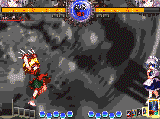

 

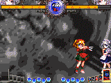

其他：还推荐的有人魂等，和2卡差不多，不过效果不如2卡就是。再其他的SC方式是真没好用的了。原本想推荐那个3卡一堆刀子的，但是发现不磨血后就算了……至于不用SC的方式还有啥更好的则欢迎补充。

### 雪希补充：关于人偶压起身，有以下几种常见的方法

1. 择2C  236B 
   最普通的方法，没择到剩下0.2灵左右，择到必爆，不过要注意爆灵之后可受身的，在近版位置可以爆灵之后JA  J6A JB连段出圈。当对方的灵不满的时候用来压起身很恶心的，基本上必爆，值得注意的是择要是被防对了是可以DD的，所以就出现了第二种方法
2. 择  3A/623抓DD
   只要猜到对方要DD就能这样抓，不过要是对方没DD的话就只能接236或者J2B之类的后续磨灵了
3. DB/3A
   这种方法主要是应对起身28的，由于DB的滑行使得较远距离的起身28也能抓到
   3A要是猜错被防御之后还可以接236继续代入压制
4. 择  H6C 236
   同方法1一样，择到必爆，但是这种方法优越于要是在H6C之后接上236，就算5灵满也是爆的。不过236的时候可能被人逃，要是对自己的灵压有信心就大胆用吧。爆灵之后版边连段要改成JA  J6C JB J6C.
5. （DA）  22B/C （DC）
   22B/C用于表里择，要是手速快的可以加个DA抓抓28，要是打逆成功，人偶打中之后可以接个DC出圈，要是人偶被防接DC有可能被人确反。若加上DA的话需要一定手速，这种压制方法代表人物老木绵。
6.  9D过头（44）
   同为表里择
7. J2B代入推板
   比较朴实的方法，放弃强爆灵而选择代入压制，要是对自己压制有信心就可以这样用
8. DB 人偶  DB
   用于绝杀，不过DB接人偶的时机要控制在第一个人偶粘上来的一瞬间，不然可能被人逃走的。
9. 择  银符
   同样用于绝杀，不管有没有择到基本上必爆灵，同理还有人偶  DB速符之类的，不过速符削灵较少。

以上提供了很多种方式，在实战中要根据对手的习惯来进行选择，说白了就是猜
比如你第一次放人偶被他28逃了，你第二次就能选择DB或者3A抓28,，等他老实了再来强爆灵，记住套路要多变。
另外附赠起身数据：移动起身距离排名，越远者越难关角落：
  空≥衣玖＞帕秋莉＞琪露诺≥爱丽丝＞妖梦=紫＞幽幽子=文=诹访子＞魔理沙=蕾米=小町=天子=早苗=美铃=＞灵梦=铃仙＞咲夜。

原地起身速度排名，越快者越难连续压制：
  幽幽子＞空＞妖梦=诹访子＞早苗＞美铃＞帕秋莉＞爱丽丝=蕾米=衣玖＞天子=琪露诺＞灵梦＞萃香＞魔理沙=咲夜=文＞小町＞铃仙＞紫。

移动起身速度排名，越快者越难连续压制，与移动结束的时间差越小者越难捕捉位置：
  蕾米＞咲夜=天子＞小町=美铃＞萃香=文＞帕秋莉＞爱丽丝＞魔理沙＞早苗＞灵梦=琪露诺＞空＞妖梦＞铃仙＞幽幽子＞紫＞衣玖＞诹访子。 

  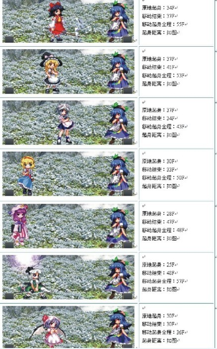

+

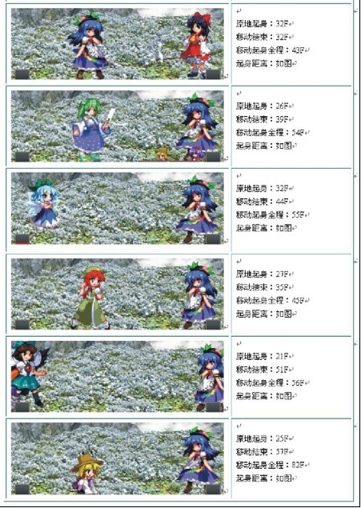

## 立回

> 立回思路： 16的体术平均发生速度并不像一个快速机，反倒是判定都非常强大。而弹幕由于B系列弹幕非常强的掩护性和 JC的强势，使得16的立回很舒服。贴身的时候，如果不是处于16压制阶段，那么多半是不利不能拼的。所以16的立回主要是依靠良好的弹幕牵制性能和非常优秀的DASH性能（真的是非常优秀了…16的DASH非常灵活速度还快）压缩对方可以DASH的空间，并且为自己的体术做好掩护。所谓的掩护，其实就是指的的体术能够打出去，因为16本身J6A/3A的强硬而其他体术普遍偏慢，使得16的体术出手要求较大的空间，但是一旦出手，就很少有人能康回去（中距离体术机体可以稳稳康回J6A，但是普遍怕16弹幕，多扔弹幕就是了）。尽管16是高速机，但是记住16不是高速体术/弹幕机，而是一个平衡的机体。主体术还是主弹幕，由对方的打法和机体性能来决定。体术不行换弹幕，弹幕不行换体术。弹幕体术都不行，就老老实实铁着或者跑开这个不利的位置。另外记得16的体术对付比自己位置高的人（16也在空中时）和地面时有较大缺陷，平行位置J6A才是16最喜欢的位置，碰上在地面的，多设置弹幕，碰上比自己高的，J8A/JB都不是一个安稳的选择，继续789D飞上去才舒服。另外别总想着抓立回轨道，如果抓不到，可以数着DASH次数然后提前靠J2B  JC来向他可能落地的地方撒一把，最后直接JA上去进入压制。

一些对策：我沙包，打过的机体比较少，一直以来又不能坚持打，只写几个自己比较会打的机体，大部分还是要看SLASH的那个攻略（不过那个攻略我就记得JC  JC JC 了……不喜欢那个打法的也可以看看这个）

### 对 红魔

唔……我最会打的机体之一…立回上别想了，16的JA不能看，要打就直接J6A上，红魔大部分体术拼不过J6A，2个身位往外，提前读体术J6A康  回去妥妥的。如果对面先逃开了，扔JB总不会劣势，但是追击的话可能会被J6A反康，所以就扔吧。红魔的擦弹能力弱，29的话还没到最高点就无法擦弹了，  所以多扔弹幕是件挺王道的事情，虽然我不喜欢高空立回打红魔，但是高空确实是红魔弱项，如果被粘的实在出不了手，飞上天去扔弹幕再下来，这样很稳妥。另外  由于红魔3A  2A的性能，16除非在红魔正上方，否则别想裸体术下去，老老实实扔弹幕吧…还有就是1一个半身位以内，附近没你的弹幕在牵制，那么16是很不利的，再近  就不提了，4A点死你，稍微远点，你敢起跳或者2B，对方就可以直接J2A抓你下来。这个时候建议缩着-  -或者你能确定对方不会3A，那么直接升龙是没问题的~比2B好用太多了…另外红魔也没办法康16的3A，另外由于他那个诡异的轨迹，预读29  J2A来一个3A也很稳，不过对面会立刻对策你，也就是扔JB，这个时候就去29  J6A去抓弹幕硬直好了，反正不是太吃亏……压红魔方面没什么好说的，小心凹，小心4A插动，尤其对方有夜王的时候，良好的放帧骗4A插动是压红魔利器。  6C/2C之后J2A被稳稳2A，小心使用，在压制时红魔的身材还算不得恼人，请随便压…红魔你的时候逃点基本就那么几个，236之后可以直接逃，3A之  后可以直接逃，J2A之后可以直接28，其他的都比较需要猜。这里说几点，一个是红魔J2A太高的话必须用J2C取消，否则16可以抢他落地A，要不  J2A就得放帧，放帧嘛……就可以一键升龙-  -||（当然如果你被地面C黏住了就别想了…毕竟16的升龙只是判定比对面J2A强，不带无敌的…）。还有一个是红魔3A，太近的时候不但可以抢（但是小  心对面猜623凹你，不过可以DD掉），太远的时候因为3A判定分3段，如果能判断只能是最后一段打到你，那么是可以44的……（时机只剩1段或者距离只  剩1段都可以，也就是可以逃3A压起身……和2A  3A LOOP）最近发现如果距离较远（3A红魔有利距离内皆可），如果红魔是2A后3A，那么可以后跳扔弹幕，或者直接后跳JA/J6A抓他，反正结论就是版  中3A各种好逃。还有就是红魔AAAA，前两段很长，但是第三段不长，甚至相当短，所以嘛-  -铜钱或者44随你，因为第三段A是两下，硬直相当大，所以如果你胆子够大，甚至可以DA  伤魂反一下试试…

### 内战对16

内战真的没啥可说的，实力差不多的话就看抽卡了-  -对于新人来说请注意16  623和2A  3A的使用，内战能把这3样东西练的相当好。

### 对  UU

弹幕UU我不会打，但是我知道UU的弹幕是微诱导，而且是一串的。所以立回时除了扔C较快系列弹幕防止对方扔弹幕外，还可以利用8D  和在地面来引诱UU  C弹的轨迹，然后找准缝隙扔弹幕，这样至少16不会太劣势。体术UU……DC就不说了吧，范围老木大……J6A也不说了吧-  -防住后6DD  623C确反，其他就是注意范围老木大还能打逆。下面说UU几个体术。一个是对付J2A，UU的J2A相当慢，但是出来了你就别想反或者逃。对付这里  UU，6B/后跳JB是王道，B弹幕+大跳，会让UU根本踹不出J2A来，找准机会拉8D  9D上去直接JA踹找位置空降下来的UU，别犹豫，上去打完连段出圈继续压制，一犹豫就是你被日了，另外别想着找机会空降，你飞不过UU的-  -|||第二个是绕圈JA  ，比较常见的就是16在地面扔弹幕，对面从后面绕JA你，这个时候2B  623B就好了-  -||还有2A，从数据上来说，UU连续2A的话，16是抢不了的。但是UU带着惯性的2A也最多可以打3下然后就推开了，这个时候要DASH或者弹幕。  猜吧-  -对面连续体术推板，这个时候送2A伤魂无比简单……最后是UU起身太快，请放弃623结尾的连段（尤其没升级的），J2A  JA J2A 623请改成J2A  JA J2A 2B然后直接扔SC，否则被逃张2卡太简单了…另外连续J2A压制，16的身材直接6D走，没啥好说的。

### 对  19

没改龙之眼就多扔B，改了就扔C抵消掉再扔B，反正19擦B很烦躁。别冲动，弹幕限制住7D  J2A后再上，否则必死无疑。压制上19可以6D  2A 6A，那就多用3A  236C。其他没啥了，哦，16的J8A位置微妙，如果利用的好，16的J8A是可以绕过19的J2A判定而直接日到19本体的，而且J8A持续长判定  广，爱绕圈的19用这个来打不错-  -另外因为28起跳19太高的原因，16的28  JA是踹不到19的-  -直接J8A吧……

### 小  爱

扔弹幕（6C很好用），压。3A必定2HIT，请放心厨……没了 -  -||哦，还有，躲开6A就不说了，要说的是DA。因为身位问题，16地面大部分体术对上小爱DA都会悲剧…(5A  DA ）甚至低空JA也会悲剧，再加上小爱头顶防御除去提前布置好的玩偶防御力实在不足，所以实在打不过的话就请多空降，真没了。

### 图  书

那一串取消我真不知道裸体术怎么打，跟打青蛙差不多，就当在打弹幕游戏吧-  -扔扔扔  16无论什么弹幕对图书都不吃亏，尤其是B系列，除了齿轮图书都消不干净。小心6C摸奖，避开6C再扔。倒是22摸奖发动太慢，还需要在地面，不容易中。  抓住机会抓落地，然后和小爱一样，尽量压到死。尤其图书这个机体对灵很珍爱的，多打打乱动骗骗凹，让他们DD一次比吃一套16连段都心疼-  -|||

### 黑白

高级黑白最近打了傲娇，谁告诉我怎么防他JA爆显……对不起，看见一套3600无SC连段我已经看傻了……对黑白想说的就是除了DB  你在地面是拼不过黑白的。其他我真没对策。

### 红  白

2A点JA不说了吧，老生常谈了，下面也说了J2A应对方法。对红白一个是6C摸对面JC，红白JC硬直很大，也比较硬，全拼的话16  J6C很难和JC拼，但是好在黄纸不大，所以会漏刀子日到对方。其他就是对面如果设置的两张纸以上，请别妄想直接去拼了，擦干净弹幕再扔JC。或者就直接  抓对面JC硬直。红雪说红白很怕16在头顶上扔JC，请多试试吧。压制方面。红白的压制是可以铁的，但是要逃还是麻烦，要不猜2A直接后跳J2B/J2A  反日，要不就只有DD了…尽管红白压制不是很强，想不DD就逃红白压制还是比较费劲…（有一堆可以X的点，我用紫X无压力，16嘛……就  ……）

### 紫

紫在地面时，3A  DC 623C的存在让16从地面进攻紫特别困难，低空也很飘渺，所以空降就成了主旋律，就算这样也要注意到2B  623B连续防空，要多骗下，不过紫追击能力差，16骗起来压力不是太大，就是注意别在J8A的路上。但是在空中就好说了，虽然16对紫，弹幕上实在不占  优，但是紫的弹幕硬直大，16的速度完全可以裸体术，如果不放心就高空JC再体术。注意紫妈的C是有后座力的，请多DASH一段就好了。压制方面，紫拿着  蓝大人的时候就别想逃了，如果能铁着，以16的身材，紫想强破16还是有难度-  -多带灵反多练铁壁吧，就这样。

### 核弹

我打核弹都能豪日我，我虽然知道要躲开一次66  JA和DA的距离，要多在抓对方刹车上下功夫，但是……还是打不赢。面对核弹，用铜钱逃压很好用。

### YM

没啥好说的，小心YM地面6A防空和2A点你。YM压制没无缝，看见6A直接拉8D走，07也不是无缝的。空中拼立回别想太稳，YM的JA太快，但是完全  拼不过J6A,所以就全都最速取消吧。别想着扔下弹幕看看情况再出手，会被J8A  JA日到高潮。压制方面YM太矮，所以可以铁16压制，所以呢，16压YM的时候请多用J2B  J2C，保持自己在天上，这样对方弹幕就能吃全了，其他就没了。真的感觉和YM打就是互猜，压制也是猜各种凹，立回也是各种猜JA……另外因为YM刹车不  好，1.5身位3A，还有空中提前623B防空，弹幕后直接623C骗JA都很好用，可以多用。214  连续3段，第二段是下择，之后16立刻用6A，会因为身位问题避开第三段，如果不取消，就被6A日。很多不会打的YM会连续中，请多利用。不过有的YM就  会后跳，那就3A吧-  -YM 5B硬直很大，16可以确认2A伤魂。对付喜欢D2A的YM可以6A。

### 西瓜

不会打，挺克16的。我都是当图书来打立回，当YM来压制…

### 中  国

除去623防空很墙里外，C和小爱6A类似，我都当小爱打…也是速度很快的机体。而且那个C让16从平行距离很难进攻。这导致一个是对方抓16弹幕硬  直比较容易，所以立回保证距离再扔弹幕，一个是16稳妥的进攻套路很难。214牵制效果明显，JC从高空撒也不错，另外别看他JA是上翘的，但是J2A对  地判定足够还能打逆，所以导致2B没623好用，真的。另外这个机体出手快，起身快，44性能好，没SC的时候压这个机体起身挺费劲的。还是少用623结  尾的连段吧。

### 文

我最头疼的机体之一。胜率不低是因为火力输出差距实在太大，但是立回我除了猥琐真不知道怎么打。多扔弹幕外我一点办法没有-  -那个J8A别想打回去，老老实实跑路或者防着。那个JA判定特别好，会打16的文基本不怕你2B，还是623靠谱。其他没了。

### 天子

当16内战打。3A  2HIT可以厨，22可以用623C稳日。铜钱对付它的压制很好用，其他没了。

### 小D

判定各种空白，别多想，直接冲上去拼JA。只要体术抓得准，他J6A  J2A都打不出。如果范围比较远，6C消掉其一切弹幕，然后扔个B就去抓小D吧！别怕，越缩他J2A  J6A的越开心。

其他机体基本没怎么打过，就记得兔子DA后236B有缝，可以直接J8A，其他不清楚了……青蛙打太少，早苗……高飞星星大妈流我只会ESC。到现在我一个9都没打过（-_,真心没碰到过。

吐槽：这算毛策略啊，根本就是猥琐逃压攻略吧！满屏幕的623大丈夫？！

## 有关F式

> 基本思想就是利用被打中硬直然后用JA踹蹲姿。因为这时虽然对方已经是蹲姿，但是判定还是站姿，所以只要能踹中对方站姿，那么就可以了。比较安稳的是差半个身位左右5B后JA。5C后JA也是可以的，不过距离要稍微远点。其他弹幕要求会更高一些（6C  2C基本不行，2B要求对方是站姿且不是矮子）。具体方式请找人陪同练习吧……毕竟这个距离感很需要练习的=  =能够练好F式，那么16在压制中就又有了一个强力的上择（因为J2A的存在所以对方很难逃）而且其实JA踹到站姿后最速J2A，对方无法6D走也是F式的功劳。至于其他方式还能怎样使出F式的踹法，我还不太清楚=  =希望前辈们指教。

F式实测：今天突然学会了F式的JA压制，表示这种压制非常强大。足够弥补很多16压制上的不足。这里说下测试结果：（很不够，欢迎其他16来更多使用方法）

1. 妖梦西瓜兔子不可用。其他人均可用出F式压制
2. 因为16 JA的判定问题。所以贴身F式很难用，基本是要有一定距离。最佳距离是妖怪之山那张地图版边地面上的线。在那里任何弹幕后的JA几乎都可以成功（前提是弹幕打上了……）当然，身材越高的人对这个距离要求越低（可以更近的情况下使用）
3. 目前我用出来的套路：
   推板中：6D 放帧JA（要踹的低，而且有下落趋势）或者3D JA后起跳JA。6A 6C  JA位置正好合适，确认6C站姿即可稳稳的直接JA~
   版边：就是那条线附近（还可以更远点）2B  /6C/2C 后升JA。
   这  里非常推荐版边这个。因为这个JA就可以又抓DD又上择。后续还有J2A取消，压制变化更多。而且远距离（也就是刚才说这个距离），J2A判定是打不到人  的，稍微近点的J2A后623C也经常打不到人，而JA就没这个问题了。（再远的话就要变9D  3D了……）这里不推荐5B的原因是可能5B后JA太快了，反而抓不到2DD了……
   （具体的没测试，可能错了=  =不过既然无缝弹幕安稳了，还用这个危险的超大缝压制干啥……）

**F式要确认对手中弹幕时为站姿才可以使用**

某F式压制演示：GIF  3张，其中后两份为11区某16实战中打出来的。

 

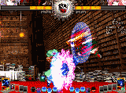

 

## 一些补充

一个是对地的问题，16的JA判定还是不太够，所以经常出现被人2A点JA的情况，有些喜欢裸体术的16不扔弹幕就空降JA，就会被点的很烦躁，这个时候可以试试J2A，如果打的准，判定范围完全够，就是需要掌控一下时机了（持续太短的问题）。

另外是压制中，防错之后只有2A  6A DA有利……这里要说的就是DA，DA是16重要上择（你没看错……-  -），虽然取消很烂，但是被错防后16  1F有利，这个时候16的4A是8F，其他机体最快是7F，所以16是可以抢4A的，另外**因为网络延迟哪怕防对了对方可能都抢不过你**-  -||那么防对之后呢？跟11打，发现16DA后可以44，因为不利帧不是很长，44可以躲掉大部分用来抢招的技能。再然后可以继续DA-  -我就被11  DA 44 DA伤魂日了4000，算是初见杀，不过如果不是追击能力很强的SC，这样取消DA确实也没啥责任……如果对方敢6D过来追击，你可以不44直接抢  AAA……

还有3A。3A因为防错  1HIT后取消时机过短，导致大部分人无法确认后取消，所以只能猜了，导致很多新人16都不敢用。但是实战中，有很多很了解16的人会在防对2A  5A后直接2DD,这个时候6A追击不到-  -||请多用3A然后猜236吧~能够打中很多乱跑的人=  =还有就是对方不足1灵半时，猜3A  236C也非常好，基本就直接破防了，后续66  JA J2A HJB，稳定出圈，是个不错的压制套路。

最后压起身说下绿  剑的应用（236改改），简单来说就是开2卡，然后3A  236B取消，这个时候对方被2卡黏住，然后66JB/  JA J6C/JA J6A落地，绿箭启动，随你爆灵。优点是全程无缝，伤害高，缺点嘛，那就是没了原236，连段，摸奖，  DA 3A后取消都成了问题，立回会缩很多（缺点和离剑差不多，不过离剑对于立回和3A的帮助是巨大的，反倒是压制上削灵太弱）。所以到底好不好，用不用，自己  衡量

# 必杀技示范GIF(搬运wiki)

> 钢琴男

> 简单地说，这一章被楼主鸽了，后面内容为钢琴男搬运

## 236 系统

### マジックスターソード

**弾性能**

表格待加

**技性能**

表格待加

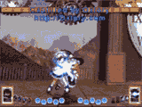

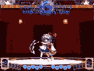

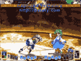

### 離剣の見

**弾性能**

表格待加

**技性能**

表格待加

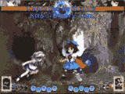

### パラレルブレーン

**弾性能**

表格待加

**技性能**

表格待加

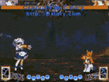

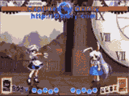

## 623 系统

### クロースアップマジック

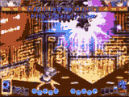

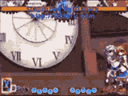

### プロペリングシルバー

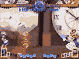

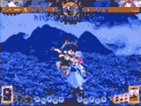

### ダンシングスターソード

## 214 系统

### クロースアップマジック